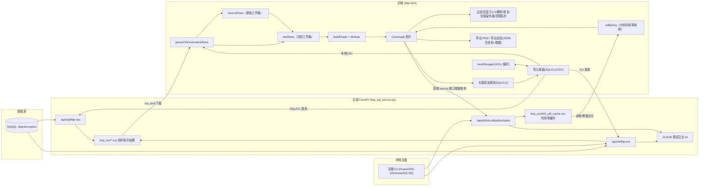

```mermaid
flowchart LR
  subgraph DB["数据源"]
    A[(MySQL: lldpinformation)]
  end

  subgraph BE["后端 FastAPI (lldp_sql_service.py)"]
    B1["/api/sql/lldp-csv"]
    B2["/api/cli/lldp-csv"]
    B3["/api/cli/link-utilization/tasks"]
    B4["tmp_csv/*.csv 临时拓扑结果"]
    B5["tmp_csv/link_util_cache.csv 利用率缓存"]
    B6["CLI/Util 调试日志 txt"]
  end

  subgraph FE["前端 (lldp.html)"]
    C1["导入弹窗(SQL/CLI/CSV)"]
    C2["parseCSV/normalizeRows"]
    C3["sourceRows（原始工作集）"]
    C4["rawRows（当前工作集）"]
    C5["buildGraph + dedupe"]
    C6["Cytoscape 拓扑"]
    C7["过滤/仅显示172/删除/恢复/仅保留邻接/范围拓扑"]
    C8["右键追加查询(SQL/CLI)"]
    C9["utilByKey（内存利用率映射）"]
    C10["导出 PNG / 导出会话(JSON含坐标+数据)"]
    C11["localStorage(UI/CLI 偏好)"]
  end

  subgraph NET["网络设备"]
    D1["设备CLI (Huawei/NX-OS/Arista/IOS-XR)"]
  end

  A --> B1
  A --> B2
  D1 --> B2
  D1 --> B3

  B1 --> B4
  B2 --> B4
  B3 --> B5
  B2 --> B6
  B3 --> B6

  C1 -->|SQL/CLI 调用| B1
  C1 -->|CLI 调用| B2
  C1 -->|本地CSV| C2
  B4 -->|csv_text/下载| C2

  C2 --> C3
  C2 --> C4
  C3 --> C4
  C4 --> C5 --> C6
  C6 --> C7
  C6 --> C8 --> C1
  C6 --> C10

  C6 -->|提取 source 端口增量查询| B3
  B5 -->|读取/增量合并| C9
  C9 --> C6

  C11 <--> C1

```