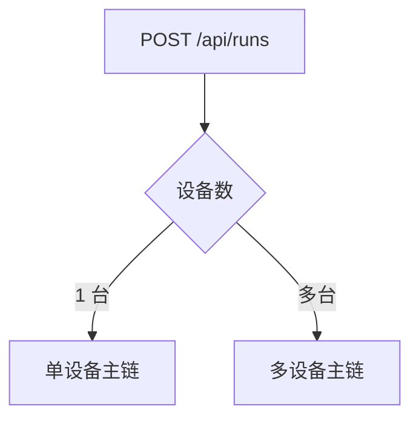
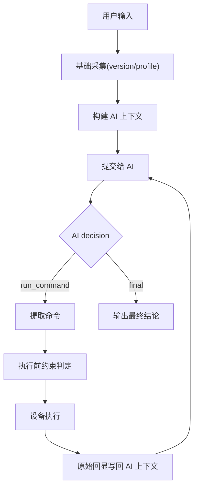
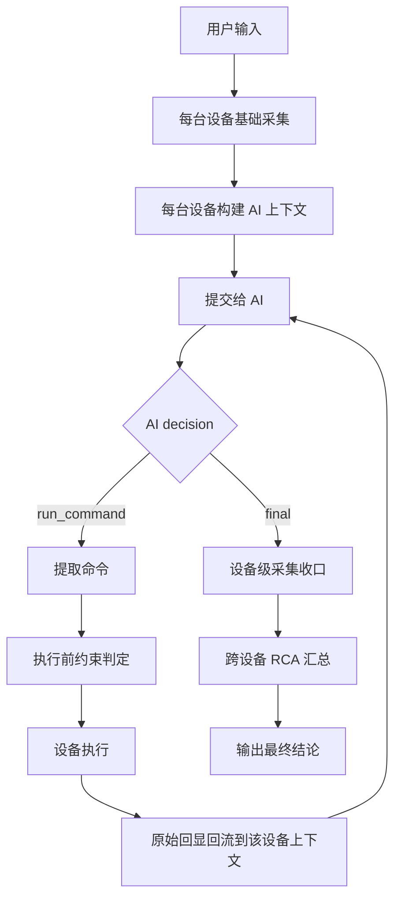

# NetOps AI 主链与分支判定说明

本文档用于说明当前系统在 `统一 /api/runs` 主链上的完整处理逻辑，包括：

- 主链从哪里开始
- 在哪里发生分支判定
- 每个分支为什么存在
- 单设备与多设备各自如何收口
- 哪些信号只是辅助 AI，而不是替 AI 做决定

本文档面向两个目标：

1. 让产品/运维可以审计系统是否仍然遵守“AI 决定命令，系统负责执行和回流”的主线
2. 让后续优化时不再把额外流程偷偷塞进主链

---

## 1. 主线原则

当前系统的最高优先级主线是：

`用户问题 -> AI 规划命令 -> 系统执行设备命令 -> 原始回显回流给 AI -> AI 继续判断 -> 输出最终结论`

约束：

- 不允许系统绕过 AI 直接决定诊断方向
- 不允许系统把中间摘要当成最终事实强行喂给 AI
- 不允许为了优化某个单场景，插入额外设备探测步骤
- 允许的优化只能发生在主链内部：
  - 压缩 AI 上下文
  - 过滤重复/已失败命令
  - 更好地暴露运行时约束

---

## 2. 统一入口总图

统一入口在：

- [/Users/zhangwei/Documents/Python/netops-ai-v1/backend/app/api/routes.py](/Users/zhangwei/Documents/Python/netops-ai-v1/backend/app/api/routes.py)

创建入口：

- `POST /api/runs`

统一入口只做第一层分流：

1. `devices == 1`
   - 落到单设备会话主链
2. `devices > 1`
   - 落到多设备协同主链

这是**入口分支**，不是诊断分支。

---

## 3. 主链总览

### 3.1 单设备主链

代码入口：

- [/Users/zhangwei/Documents/Python/netops-ai-v1/backend/app/services/orchestrator.py](/Users/zhangwei/Documents/Python/netops-ai-v1/backend/app/services/orchestrator.py)
- `ConversationOrchestrator.stream_message()`

主链结构：

### 3.2 多设备主链

代码入口：

- [/Users/zhangwei/Documents/Python/netops-ai-v1/backend/app/services/job_orchestrator_v2.py](/Users/zhangwei/Documents/Python/netops-ai-v1/backend/app/services/job_orchestrator_v2.py)
- `_collect_device_with_llm()`

主链结构：

---

## 4. 单设备主链中的分支判定

### 4.1 LLM 可用性分支

位置：

- `stream_message()`

逻辑：

1. 如果 `deepseek_diagnoser.enabled == false`
2. 直接输出“LLM 不可用”总结
3. 不进入 AI 规划和设备执行

这属于**前置状态分支**。

---

### 4.2 首轮基础采集分支

位置：

- `_run_autonomous_loop()`

逻辑：

当会话里还没有任何命令时，先执行最小基础采集：

1. `version probe`
2. `profile probe`

目的：

- 获取厂商/版本/设备画像
- 获取权限/模式初始信号
- 为后续 AI 规划提供“当前设备是什么”的事实基础

说明：

- 这是主链内固定基础采集
- 不是按故障类型扩展 playbook

---

### 4.3 AI 规划结果分支

位置：

- `_run_autonomous_loop()`

AI 当前只允许两类主决策：

1. `decision=run_command`
   - 进入命令提取与执行链
2. `decision=final`
   - 进入最终总结链

异常分支：

- `plan 为空 / 不可解析`
  - 当前轮失败并结束

---

### 4.4 命令提取分支

位置：

- `_extract_plan_commands()`

逻辑：

AI 返回的命令可能是：

1. 单条 `command`
2. 多条 `commands[]`
3. 复合命令（用换行或 `;` 连接）

系统会把它们拆成可执行命令列表。

这是**结构展开分支**，不是决策分支。

---

### 4.5 执行前约束分支

位置：

- `_execute_with_policy()`
- `_execute_batch_with_policy()`

这是单设备最重要的一组分支，执行顺序如下：

1. **会话模式范围判定**
   - `diagnosis / query / config`
   - 例如：
     - `diagnosis/query` 下写命令会被 `mode_scope_block`

2. **风险策略判定**
   - 低风险 / 中风险 / 高风险
   - 对应：
     - 直接放行
     - 待确认
     - 拦截

3. **命令能力判定**
   - 命中已知 `block/rewrite`
   - 例如：
     - 已知命令在该版本不可用
     - 已知应改写为更兼容命令

4. **近期失败命令过滤**
   - 同会话最近失败/阻断/拒绝过的同命令，不再立即重试

5. **同轮重复命令去重**
   - 一次 AI 规划里完全相同的命令只保留一条

这些分支都发生在“设备执行之前”，不会增加额外设备探测。

---

### 4.6 批量分组分支

位置：

- `_run_autonomous_loop()`

逻辑：

如果：

- `batch_execution_enabled = true`
- 且 `plan_commands > 1`

则进入批量命令组执行；否则按单条顺序执行。

批量分支的目的：

- 减少 AI 与设备之间的轮次
- 在不增加额外流程的前提下压缩耗时

---

### 4.7 执行结果分支

单条或批量执行后，主链根据结果继续分流：

1. `pending_confirm`
   - 等待人工确认
   - 主链暂停，不再自动继续

2. `blocked`
   - 把阻断原因写回 AI 上下文
   - 下一轮交给 AI 自行调整命令

3. `failed`
   - 把失败信息写回 AI 上下文
   - 下一轮交给 AI 自行调整命令

4. `succeeded`
   - 原始回显写回 AI 上下文
   - 继续下一轮 AI 判断

5. `operator_stop`
   - 会话停止并收口

---

## 5. 多设备主链中的分支判定

### 5.1 设备级采集分支

位置：

- `_collect_device_with_llm()`

多设备不是“一次让 AI 统一判断所有设备”，而是：

1. 每台设备各自维护一条设备内 AI 采集链
2. 每台设备都执行：
   - 基础采集
   - AI 规划
   - 执行
   - 回显回流
3. 最后再做跨设备汇总

这能保证：

- 设备间并行
- 设备内仍然保持单链闭环

---

### 5.2 多设备 AI 规划分支

位置：

- `_collect_device_with_llm()`

与单设备一致，AI 设备级决策只有两类：

1. `run_command`
2. `final`

区别是：

- `final` 在这里表示该设备级采集收口
- 不代表整个多设备任务立即结束

整个任务是否结束，还要看所有设备和 RCA 汇总是否完成。

---

### 5.3 多设备执行前分支

位置：

- `_collect_device_with_llm()`
- `_run_device_command()`

多设备链路在单设备基础上额外有两个通用分支：

1. **权限不足过滤**
   - 如果当前设备已明确处于低权限
   - 且 AI 给出的命令属于明显需要特权的只读命令
   - 则直接过滤，不浪费设备命令轮次

2. **重复保护**
   - `repeated_guard`
   - 同设备内相同命令超过阈值后不再继续执行

这两条仍然是主链内联优化，不增加探测步骤。

---

### 5.4 多设备任务级分支

位置：

- `job status / phase` 流转

任务级还会额外存在这些分支：

1. `waiting_approval`
   - 命令组等待审批

2. `executing`
   - 批量动作组执行中

3. `cancelled`
   - 操作员停止整个多设备任务

4. `completed`
   - 所有设备已收口，且 RCA 已完成

---

## 6. 运行时附加信号：哪些是辅助，哪些不是

当前系统会把一些**辅助信号**附加给 AI，但这些都不是额外主流程：

### 6.1 过滤语法能力

目的：

- 告诉 AI 当前设备更可能支持哪些过滤语法
- 例如：
  - `include`
  - `grep`
  - `count`
  - `brief`

作用：

- 帮 AI 更稳定地产生短命令
- 不替 AI 选诊断方向

### 6.2 权限信号

目的：

- 告诉 AI 当前会话是否可能权限不足

作用：

- 降低“明显需要特权但必定失败”的命令

### 6.3 输出压缩信号

目的：

- 告诉 AI 当前更适合先摘要、后详情

作用：

- 减少全量输出
- 减少上下文噪声

### 6.4 SOP 候选

目的：

- 告诉 AI 当前有哪些可参考的旁挂 SOP

作用：

- 仅供参考，不直接执行
- AI 自己决定是否引用

---

## 7. 哪些分支会暂停主链

以下分支会让主链暂停，而不是继续推进：

1. `pending_confirm`
   - 命令或命令组待确认

2. `operator_stop`
   - 用户停止会话 / 停止任务

3. `LLM disabled`
   - 模型不可用

4. `LLM plan unparseable`
   - 当前轮没有可执行决策，且无法继续

---

## 8. 哪些分支不会增加额外开销

以下优化都属于“主链内联优化”，不额外增加设备探测：

1. AI 上下文裁剪
2. 长回显压缩
3. 同轮重复命令去重
4. 近期失败命令抑制
5. 过滤语法能力信号
6. 权限信号
7. 输出压缩信号

这些只改变：

- AI 看见什么
- AI 更少走弯路

不会改变：

- 设备侧命令总类
- 主链阶段数
- 系统偷偷替 AI 做决策

---

## 9. 统一入口下的主链/分支速查表

| 层级 | 判定点 | 分支 | 结果 |
|---|---|---|---|
| 入口 | `devices` 数量 | 单设备 / 多设备 | 路由到不同执行器 |
| 会话前置 | LLM 可用性 | 可用 / 不可用 | 进入 AI 主链 / 直接失败总结 |
| 首轮 | 是否已有命令 | 首轮 / 非首轮 | 是否执行基础采集 |
| AI 决策 | `decision` | `run_command` / `final` / 无效 | 执行命令 / 输出总结 / 当前轮失败 |
| 命令展开 | `command(s)` 结构 | 单条 / 多条 / 复合 | 展开为命令列表 |
| 执行前 | 模式范围 | 允许 / `mode_scope_block` | 执行 / 阻断 |
| 执行前 | 风险策略 | allow / confirm / block | 执行 / 待确认 / 阻断 |
| 执行前 | 命令能力 | allow / rewrite / block | 直接执行 / 改写后执行 / 阻断 |
| 执行前 | 近期失败命令 | 命中 / 未命中 | 过滤 / 继续 |
| 执行前 | 同轮重复命令 | 命中 / 未命中 | 去重 / 继续 |
| 执行后 | 状态 | success / failed / blocked / pending_confirm | 回流 AI / 下一轮 / 暂停 |
| 任务控制 | stop/cancel | 是 / 否 | 停止收口 / 继续 |

---

## 10. 当前实现文件索引

### 主入口

- [/Users/zhangwei/Documents/Python/netops-ai-v1/backend/app/api/routes.py](/Users/zhangwei/Documents/Python/netops-ai-v1/backend/app/api/routes.py)

### 单设备主链

- [/Users/zhangwei/Documents/Python/netops-ai-v1/backend/app/services/orchestrator.py](/Users/zhangwei/Documents/Python/netops-ai-v1/backend/app/services/orchestrator.py)

### 多设备主链

- [/Users/zhangwei/Documents/Python/netops-ai-v1/backend/app/services/job_orchestrator_v2.py](/Users/zhangwei/Documents/Python/netops-ai-v1/backend/app/services/job_orchestrator_v2.py)

### AI 规划与提示词

- [/Users/zhangwei/Documents/Python/netops-ai-v1/backend/app/services/deepseek_diagnoser.py](/Users/zhangwei/Documents/Python/netops-ai-v1/backend/app/services/deepseek_diagnoser.py)

### 运行时信号

- [/Users/zhangwei/Documents/Python/netops-ai-v1/backend/app/services/planner_signal_runtime.py](/Users/zhangwei/Documents/Python/netops-ai-v1/backend/app/services/planner_signal_runtime.py)

### 统一运行读链

- [/Users/zhangwei/Documents/Python/netops-ai-v1/backend/app/services/unified_run_service.py](/Users/zhangwei/Documents/Python/netops-ai-v1/backend/app/services/unified_run_service.py)

---

## 11. 当前维护建议

后续任何优化都建议先回答这 3 个问题：

1. 这次改动会不会新增设备侧命令？
2. 这次改动会不会在 AI 外新增一个“替 AI 判断方向”的流程？
3. 这次改动能否只在当前主链内部完成？

如果：

- 会新增设备探测
- 会新增额外阶段
- 会让系统替 AI 下方向判断

那就不应该直接进主链。
