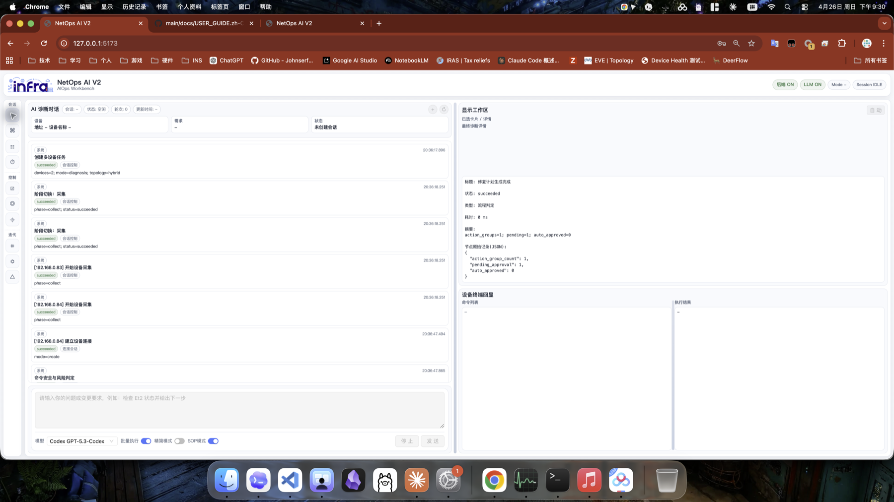
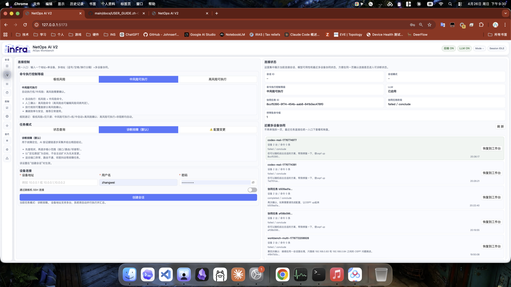
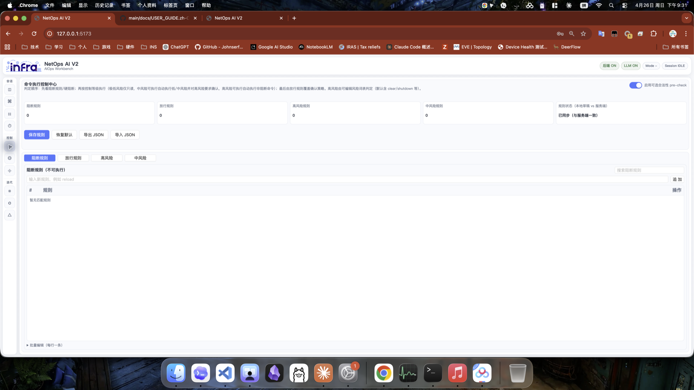
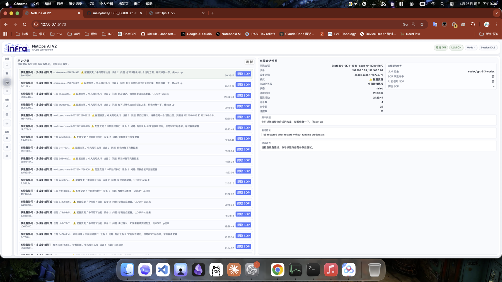
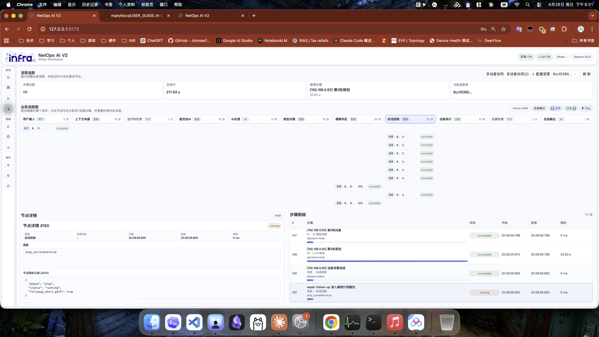
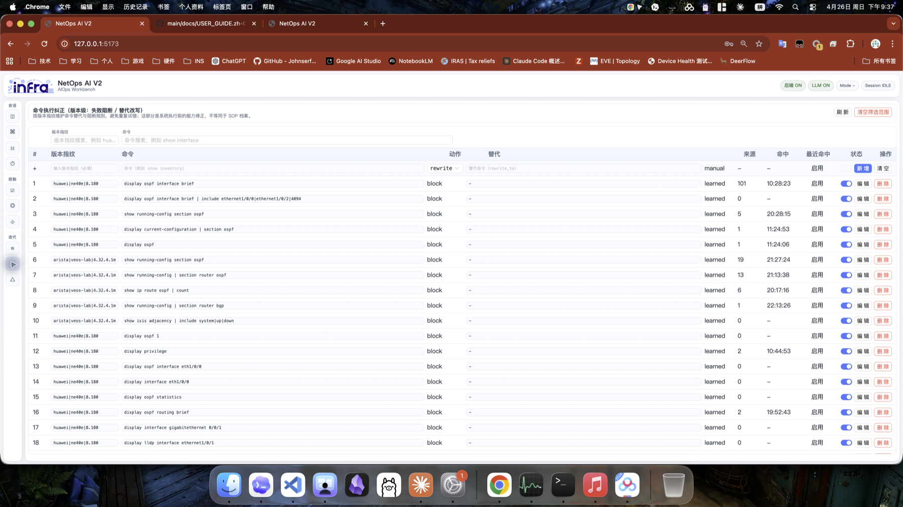
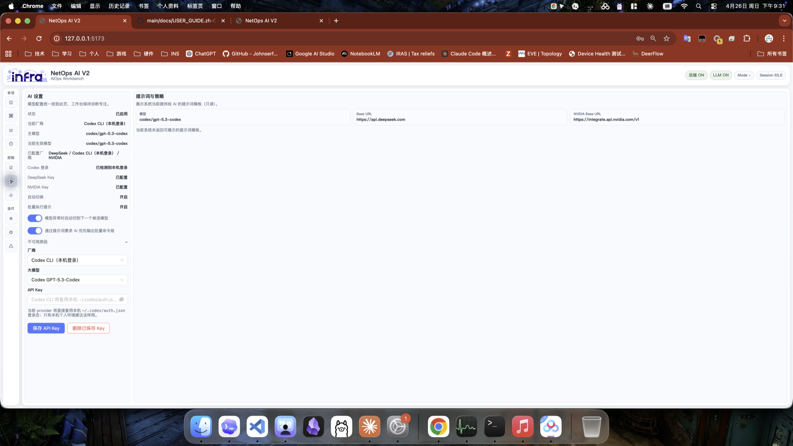
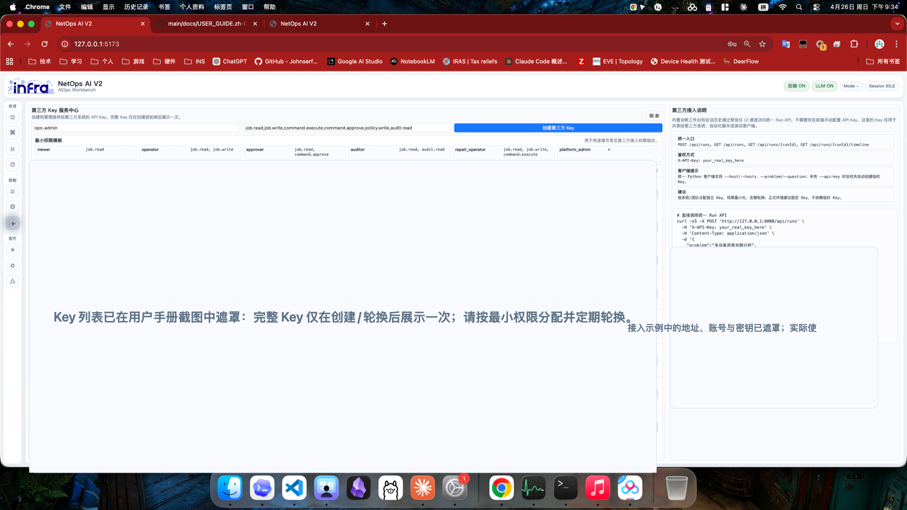
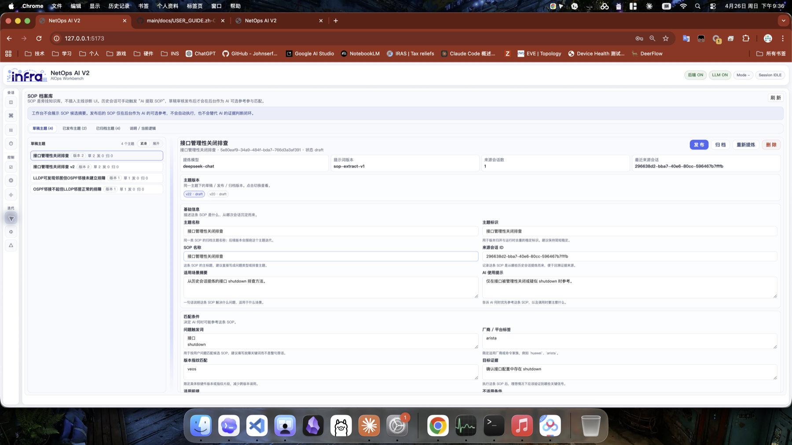
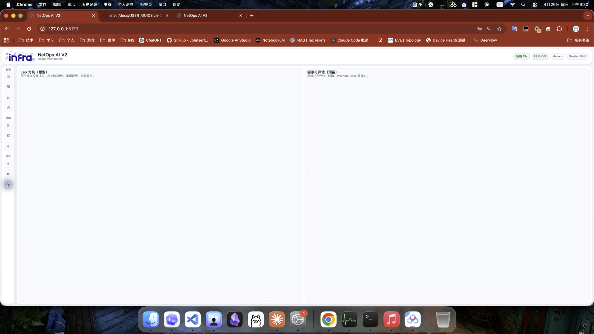

# NetOps AI V2 用户指南（中文图文版）

本文面向一线网络运维、值班工程师和平台管理员，说明如何通过本地 Web 工作台完成设备连接、AI 诊断、追加问题、命令审批、历史复盘和第三方接入管理。

截图来自本机 `http://127.0.0.1:5173/` 的 NetOps AI V2 页面。截图中的设备地址、会话 ID、问题文本仅作为本地测试样例；公开发布文档前，请确认截图中没有真实敏感信息。

## 1. 打开与登录

1. 启动后端和前端服务。
2. 在浏览器打开 `http://127.0.0.1:5173/`。
3. 页面右上角应显示 `后端 ON` 和 `LLM ON`。
4. 当前本地工作台没有单独的账号登录页，内置诊断工作台和会话历史通过受信任 UI 通道访问统一 Run API。
5. “第三方 Key 服务”只用于给外部系统、脚本或测试客户端创建 API Key，不是本地工作台登录入口。



页面顶部状态区用于确认平台是否可用：

- `后端 ON`：前端可以访问后端 API。
- `LLM ON`：当前模型可用。
- `当前模型`：展示当前生效的 provider 和模型。
- `Mode / Session`：展示当前任务模式和会话状态。

左侧导航分为三组：

- `会话`：诊断工作台、连接控制、会话历史、流程追踪。
- `控制`：命令执行控制、AI 设置、第三方 Key 服务。
- `迭代`：SOP 档案库、命令执行纠正、Lab 对抗。

## 2. 推荐操作流程

1. 进入“连接控制”，选择自动化等级和任务模式。
2. 填写设备地址、用户名、密码；一个地址表示单设备，多地址表示多设备协同。
3. 点击“创建会话”。
4. 回到“诊断工作台”，输入当前问题或变更需求。
5. 观察 AI 对话、执行卡片、显示工作区和设备终端回显。
6. 如果 AI 需要执行配置变更，先查看计划和待审批命令，再决定是否批准。
7. 诊断完成后，如果要继续追问，直接在同一个工作台会话继续输入新问题，不要重新创建任务。
8. 需要复盘时，进入“流程追踪”或“会话历史”查看证据链、命令、耗时和最终结论。

## 3. 连接控制



“连接控制”是创建单设备或多设备任务的统一入口。

### 3.1 自动化等级

- `极低风险`：通常只允许只读查询，适合首次接入或高敏感环境。
- `中风险可执行`：自动执行低/中风险命令，高风险命令需要人工确认，推荐日常排障使用。
- `高风险可执行`：非阻断命令可自动执行，仅建议在受控实验或明确授权场景使用。

### 3.2 任务模式

- `状态查询`：适合询问设备状态、接口状态、路由表等只读问题。
- `诊断排障`：默认模式，适合故障定位，AI 会基于证据逐步收敛。
- `配置变更`：涉及修复和配置下发，系统应进入计划和审批流程。

### 3.3 设备连接

- 单设备：在“设备地址”填写一个 IP 或主机名。
- 多设备：用逗号、空格或换行输入多个地址。
- 跳板机：需要通过堡垒机或中间机登录时再开启。
- 创建会话后，右侧“连接状态”和“近期多设备协同”会显示当前任务状态。

## 4. 诊断工作台

诊断工作台是日常使用频率最高的页面。左侧是 AI 诊断对话和事件流，右侧是当前选中卡片的详情、命令列表和设备回显。

### 4.1 提问方式

推荐直接描述目标，不要把历史结论复制回去。例如：

```text
两台设备 LLDP 能发现对方，但是 OSPF 起不来，帮我看看配置
```

如果是追加问题，继续在同一会话输入新需求：

```text
帮我给这两个互联接口选择合适地址并完成配置，让 OSPF up 起来
```

### 4.2 追加问题的上下文规则

同一会话中继续追问时，系统应保留历史事实，例如已成功采集的命令结果、设备基线、邻居关系和证据摘要；上一轮最终结论只作为历史展示，不应作为当前问题继续灌给模型。

正常续问时：

- `run_id/session_id` 应保持不变。
- 当前问题应更新为最新用户输入。
- 历史用户问题和事实证据应保留。
- 已确认且仍有效的只读命令不应无意义重复执行。
- 如果用户点击停止、连接失效、设备集合变化、凭据变化或会话上下文丢失，系统可能需要重新连接或重新采集事实。

### 4.3 配置变更与审批

当用户只是提问或要求分析时，系统应给出“查询结果”或“诊断结论”。只有在用户明确要求修复、配置、变更或执行动作，并且系统生成待审批命令后，才进入配置计划和审批链路。

如果看到“待审批命令组”，请先检查：

- 命令是否只作用在目标设备和目标接口上。
- 是否有回滚方案或验证命令。
- 是否符合当前自动化等级。
- 是否确实是用户本轮问题要求的动作。

## 5. 命令执行控制



该页面用于管理命令阻断、放行和风险分级策略。它负责“哪些命令可以被系统执行”，不负责替 AI 做诊断结论。

判定顺序：

1. 先看阻断规则和硬阻断。
2. 再按自动化等级判断是否可执行。
3. 最后由放行规则覆盖部分确认策略。

常见用途：

- 禁止明显危险命令，例如重启、清空、删除、关闭关键接口。
- 将某些命令列为高风险，要求人工确认。
- 将环境中明确安全的只读命令加入放行规则。
- 导出或导入 JSON 规则，方便团队统一治理。

## 6. 会话历史



会话历史同时展示单设备会话和多设备协同任务。它用于恢复、复盘和提炼 SOP。

关键区域：

- 左侧列表：历史任务、模式、自动化等级、设备数量、用户问题和创建时间。
- `提取 SOP`：从历史会话中生成 SOP 草稿。
- 右侧快照：显示设备、状态、消息数、命令数、证据数、模型记录、SOP 命中情况、用户问题和最终结论。

恢复会话时，优先确认它是否仍是你要继续提问的那条 run。追加问题应继续走当前 run，不应静默新建任务。

## 7. 流程追踪



流程追踪用于看清一次任务从用户输入到最终输出的完整链路，尤其适合排查“为什么慢”“为什么执行了某条命令”“为什么进入审批”等问题。

你可以重点查看：

- `步骤总数` 和 `总耗时`：判断任务整体复杂度。
- `最慢步骤`：定位慢在 LLM、设备命令还是后端处理。
- 泳道：用户输入、上下文构建、提交给 AI、AI 反馈、规划决策、策略判定、会话控制、设备执行、总结输出。
- 节点详情：查看某一步的摘要、耗时和原始 JSON。
- 步骤明细：逐条查看命令执行、策略判定和模型回复。

当追加问题效率不好时，优先在这里确认是否重复执行了已确认命令、是否重新进入了完整采集链路、是否因为连接或上下文丢失导致重采。

## 8. 命令执行纠正



命令执行纠正用于维护版本级的失败阻断或替代改写规则。它属于执行前能力修正，不等同于 SOP，也不应该替代 AI 的工程判断。

适用场景：

- 某个厂商或版本不支持某条命令。
- 某条命令在当前设备版本上反复失败。
- 已知存在等价替代命令。

使用原则：

- 优先记录“命令兼容性”问题，不要把具体业务结论写成规则。
- 规则应尽量绑定版本指纹，避免跨厂商、跨版本误伤。
- 删除或停用规则前，先确认是否有历史命中记录依赖它。

## 9. AI 设置



AI 设置页面集中管理当前模型、provider、API Key 状态、自动切换和提示词策略。

当前页面常见字段：

- `状态`：模型服务是否启用。
- `当前厂商`：例如 Codex CLI、DeepSeek、NVIDIA。
- `主模型` 和 `当前生效模型`：确认实际使用的模型。
- `Codex 登录`：如果复用本机 `~/.codex/auth.json`，通常无需填写 API Key。
- `自动切换`：模型异常时切换到候选模型。
- `批量执行提示`：提示 AI 优先输出可批量执行的命令组。
- `提示词与策略`：只读展示系统当前可暴露的提示词模板。

如果 AI 不响应或模型不可用，先检查这里的状态，再去看后端日志。

## 10. 第三方 Key 服务



第三方 Key 服务用于给外部系统、自动化脚本或测试客户端分配 API Key。完整 Key 只会在创建或轮换后展示一次。

使用建议：

- 按系统或团队分配独立 Key。
- 使用最小权限模板，例如 viewer、operator、approver、auditor、repair_operator。
- 正式环境建议使用固定 Key 并定期轮换。
- 不要在截图、聊天、提交记录或公开文档中暴露完整 Key。
- 删除、轮换或禁用 Key 会影响依赖它的第三方调用。

内置工作台不需要在这里手动配置 Key。它通过受信任 UI 通道访问统一 Run API。

## 11. SOP 档案库



SOP 档案库是旁挂知识库，不直接插入主线诊断 UI。历史会话可以手动触发“AI 提取 SOP”，草稿经人工审核发布后，才会作为 AI 的可选参考参与匹配。

关键原则：

- SOP 是参考，不是自动执行脚本。
- SOP 不替代 AI 对当前证据的判断。
- SOP 草稿需要人工审核，确认是否具备通用性。
- 触发词、适用前提和不适用条件要写成问题类型，不要写成单次现场对象。
- 建议最小命令组应帮助 AI 少走弯路，但不能把结论硬编码进系统。

## 12. Lab 对抗



Lab 对抗页面当前是预留能力，用于后续模拟故障注入、AI 对抗回放、案例晋级、评分和回滚评估。

当前可把它理解为未来测试工作台的入口。正式使用前，应以“诊断工作台、流程追踪、会话历史、SOP 档案库”为主。

## 13. 常见问题

### Q1：为什么没有登录弹窗？

当前本地 UI 是受信任工作台访问模式，没有单独账号密码登录页。只要前端能打开、右上角显示 `后端 ON` 和 `LLM ON`，就可以进入工作台。第三方 Key 页面是给外部客户端使用的，不是本地 UI 登录页。

### Q2：为什么追加问题时不能新建 run？

追加问题的设计目标是像和同一个网络工程师继续对话：保留历史事实和证据，更新当前问题，并让旧结论退出当前活跃态。如果新建 run，历史事实会断开，系统容易重新采集、重复命令或被旧结论带偏。

### Q3：什么时候允许重复执行命令？

如果同一 run 的上下文仍连续，已经成功采集且仍有效的事实不应无意义重复执行。以下情况可能需要重新执行：

- 用户点击停止或取消。
- 设备连接中断且上下文无法继续。
- 设备集合发生变化。
- 凭据或登录权限发生变化。
- 用户明确要求重新验证。
- 上一轮命令失败、输出不完整或证据已经过期。

### Q4：为什么命令需要审批？

命令命中高风险策略、未命中放行策略，或当前自动化等级不允许自动执行时，会进入人工审批。配置变更必须特别谨慎，审批前要确认目标设备、接口、命令、验证和回滚。

### Q5：为什么 AI 给不出结论？

常见原因包括模型不可用、设备连接失败、命令被策略阻断、证据不足或用户问题过于模糊。建议按顺序检查 AI 设置、连接控制、命令执行控制和流程追踪。

### Q6：如何判断系统慢在哪里？

进入“流程追踪”，先看 `最慢步骤`。如果慢在 LLM 规划或 RCA，重点看提交给 AI 的上下文是否过大；如果慢在设备执行，重点看命令耗时、连接重试和设备响应；如果慢在策略判定，检查规则数量和命中情况。

## 14. 安全与发布注意事项

- 不要把真实密码、完整 API Key、生产设备敏感配置放进截图。
- 配置变更前必须保留验证命令和回滚思路。
- 命令执行控制只做安全边界，不应把业务结论硬编码到规则里。
- SOP 应沉淀通用经验，不应把一次现场的端口、地址、根因直接写死。
- 发布到 GitHub 前建议再检查 `docs/images/user-manual/` 下所有图片。
