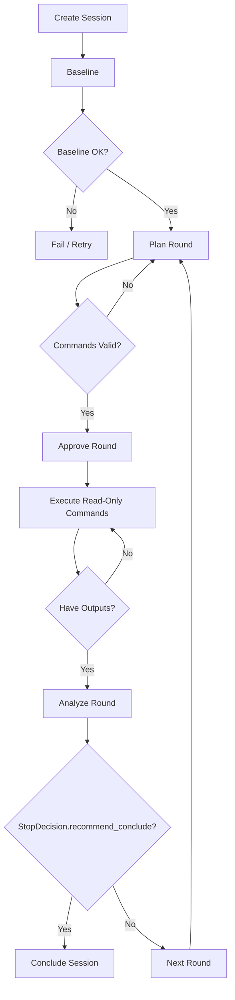

# NetDiag Check Flow

## 1. 目标
将诊断过程从“单轮一次性执行”升级为“循环检查闭环”：
- 手动模式：用户主要点击一个 `Next` 按钮。
- 自动模式：系统持续循环 `Plan -> Approve -> Execute -> Analyze`，直到建议收敛。

## 2. 流程图（Mermaid）

## 2.1 后端强约束（新增）
- 后端统一计算 `next_action`（`GET /api/netdiag/sessions/{session_id}/next_action`）。
- `baseline/plan/approve/execute/analyze/conclude` 各端点会校验是否符合下一步。
- 正在运行时返回 `busy/wait`，避免同一步并发重入或重复执行。

## 3. 手动模式（Single Next）
`Next` 按钮的决策逻辑：
1. 无 baseline -> 执行 baseline。
2. 无 round -> 生成计划。
3. round=waiting_approval 且未批准 -> 批准。
4. round=waiting_approval 且已批准 -> 执行命令。
5. round=analyzing 或已有执行输出未分析 -> AI 分析。
6. round=completed 且建议收敛 -> 结束会话。
7. round=completed/failed 且未收敛 -> 启动下一轮。

## 4. 自动模式（Loop）
自动模式启用后：
1. 若无 baseline 先补 baseline。
2. 循环执行：`Plan -> Approve -> Execute -> Analyze`。
3. 每轮检查 `stop_decision`。
4. 命中收敛条件则自动 conclude，否则继续下一轮。
5. 内置安全保护：长时间无收敛/异常状态时自动暂停并返回原因。

## 5. 观测面板
UI 同时展示三类信息：
- 实时诊断观测：思路、命令、设备回显。
- Check Pipeline：Baseline/Plan/Execute/Analyze/Converge 五段状态。
- 执行时间线：每一步的 running/success/failed 时间戳。
